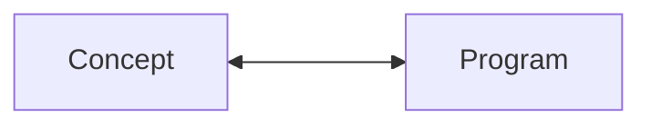

## H-ARC: A Robust Estimate of Human Performance on the Abstraction and Reasoning Corpus Benchmark

**Solim LeGris**, **Wai Keen Vong**, **Brenden Lake** and **Todd Gureckis**

<!--
Hi everyone!

Today I'll talk about my most recent work which resulted in a preprint we released a few weeks ago titled:

This work was done in collaboration with Wai Keen who is a research scientist at CDS and Brenden and Todd, my advisors
-->

---
layout: full
title: previous work
---

## Concept learning as program induction

<div class="grid w-full h-fit grid-cols-2 grid-rows-2 mt-10 mb-auto">
  <div class="grid-item grid-span-1 flex flex-col items-center justify-center">
    
    <p class="text-xs mt-2 text-gray-500">Lake et al. (2015)</p>
  </div>
  <v-clicks>
  <div class="grid-item grid-span-1 flex flex-col items-center justify-center">
    
    <p class="text-xs mt-2 text-gray-500">Zhou & Lake (2021)</p>
  </div>
  <div class="grid-item grid-col-span-2 flex flex-col items-center justify-center">
    
    <p class="text-xs mt-2 text-gray-500">Bramley et al. (2012)</p>
  </div>
</v-clicks>
</div>

<!--
People can use their concepts in more sophisticated ways than just to classify things:

They can use them for generation, explanation and even extrapolation

This kind of flexible concept learning has been studied in various settings and has often been pitted as a program induction problem.

For instance, some of Brenden's previous work captures human concepts of handwritten characters as simple programs that best explain observed examples under a Bayesian criterion.

[click] Yanli Zhou, who was previously here at NYU, has done some further work extending this idea of modelling concepts, using Bayesian program induction, to compositional concepts in the form of "alien figures".

[click] Similarly, Neil Bramley's work explores a model of how people generate hypotheses using bottom-up feature-based processes to induce rules in a Zendo inspired game.

Now, consider a similar kind of task
-->

---
layout: full
title: motivation-demo
---

# A `novel` task domain

<div class="items-center" v-drag="[60,80,233,40]">
<span class="text-2xl">Training examples</span>
</div>

<div v-drag="[60,120,130,170]">

 <p class="text-ms text-gray-500" style="margin-top: 2px;">Train input 1</p>
</div>

<v-click>
<div v-drag="[200,160,40,70]">
<span class="text-5xl">→</span>
</div>

<div v-drag="[250,120,130,170]">

 <p class="text-ms text-gray-500" style="margin-top: 2px;">Train output 1</p>
</div>

</v-click>

<v-click>
<div v-drag="[60,305,130,170]">

 <p class="text-ms text-gray-500" style="margin-top: 2px;">Train input 2</p>
</div>

<div v-drag="[200,348,40,70]">
<span class="text-5xl">→</span>
</div>

<div v-drag="[250,305,130,170]">

 <p class="text-ms text-gray-500" style="margin-top: 2px;">Train output 2</p>
</div>
</v-click>

<v-click>
<div v-drag="[500,170,233,40]">
<span class="text-2xl">Test example</span>
</div>


<div v-drag="[500,210,150,190]">

 <p class="text-ms text-gray-500" style="margin-top: 2px;">Test input</p>
</div>

<div v-drag="[660,260,40,70]">
<span class="text-5xl">→</span>
</div>

</v-click>

<div v-click="[3,7]">
<div v-drag="[758,252,58,70]">
<material-symbols-question-mark class="text-5xl"/>
</div>
</div>

<div v-click="[4,7]">
<div class="border-2 bg-neutral-500 bg-opacity-20 text-center" v-drag="[505,70,375,82]"> 
<p>Extend the blue and red lines until the edge of the grid and color their intersection yellow.</p>
</div>
</div>

<v-switch>
<template #1-5>
<div v-drag="[710,210,150,190]">

 <p class="text-ms text-gray-500" style="margin-top: 2px;">Test output</p>
</div>
</template>
</v-switch>

<v-click at="5">
<ArrowDraw color='amber' v-drag="[394,154,71,46,144]"/>
<ArrowDraw color='amber' v-drag="[395,358,66,46,215]"/>
</v-click>

<v-click at="6">
<ArrowDraw color='blue' v-drag="[190,432,54,52,270]"/>
<div v-drag="[190,488,58,59]">
<material-symbols-code-blocks-outline class="text-5xl text-blue-500"/>
</div>
</v-click>

<div v-drag="[562,400,252,126]">
<v-click at="5">
<p class="text-2xl text-amber-500"> <material-symbols-check-rounded class="text-black" /> Few-shot learning</p>
</v-click>
<v-click at="6">
<p class="text-2xl text-blue-500"> <material-symbols-check-rounded class="text-black" /> Program induction</p>
</v-click>
<v-click at="7">
<p class="text-2xl text-pink-500"> <material-symbols-check-rounded class="text-black" /> Prior knowledge</p>
</v-click>
</div>

<v-click at="7">
<div class="border-2 bg-neutral-500 bg-opacity-20 text-center" v-drag="[505,70,375,82]"> 
<p><span class="text-pink-500">Extend</span> the blue and red <span class="text-pink-500">lines</span> until the <span class="text-pink-500">edge</span> of the grid and color their <span class="text-pink-500">intersection</span> yellow.</p>
</div>
</v-click>

<!--
So you're given training examples in the following format. 

Here is a first training input.

[click] Followed by a training output. And the arrow here indicates that there is a hidden, underlying transformation between the input and output grid.

[click] For each task, you're given a few instances of the underlying transformation. And your task is to infer the program that takes any given input to the correct output.

[click] And to show that you've inferred the correct program, you're given a test input and must generate the correct output grid.

Can I get a clap of hands if you think you got the correct solution?

[click] So here the rule is pretty obvious: extend the blue and red lines until the edge of the grid and color their intersection yellow.

[click] Similarly to the previous tasks I briefly mentioned and others in the literature, learning the concept here is done in a few-shot setting

[click] The task involves inferring a kind of program

[click] The solver brings a lot of prior knowledge to bear when solving the task.
-->

---
layout: full
title: motivation-demo-2
---

# A `novel` task domain

<div class="items-center" v-drag="[60,80,233,40]">
<span class="text-2xl">Training examples</span>
</div>

<div v-drag="[60,120,105,130]">

 <p class="text-ms text-gray-500" style="margin-top: 2px;">Train input 1</p>
</div>

<div v-drag="[180,140,40,70]">
<span class="text-5xl">→</span>
</div>

<div v-drag="[250,120,120,130]">

 <p class="text-ms text-gray-500" style="margin-top: 2px;">Train output 1</p>
</div>


<div v-drag="[60,260,105,130]">

 <p class="text-ms text-gray-500" style="margin-top: 2px;">Train input 2</p>
</div>

<div v-drag="[180,290,40,70]">
<span class="text-5xl">→</span>
</div>

<div v-drag="[250,260,120,130]">

 <p class="text-ms text-gray-500" style="margin-top: 2px;">Train output 2</p>
</div>

<div v-drag="[60,400,105,130]">

 <p class="text-ms text-gray-500" style="margin-top: 2px;">Train input 3</p>
</div>

<div v-drag="[180,430,40,70]">
<span class="text-5xl">→</span>
</div>

<div v-drag="[250,400,105,130]">

 <p class="text-ms text-gray-500" style="margin-top: 2px;">Train input 3</p>
</div>


<div v-drag="[500,170,233,40]">
<span class="text-2xl">Test example</span>
</div>


<div v-drag="[500,210,150,190]">

 <p class="text-ms text-gray-500" style="margin-top: 2px;">Test input</p>
</div>

<div v-drag="[650,260,40,70]">
<span class="text-5xl">→</span>
</div>

<div v-click="[0,1]">
<div v-drag="[758,252,58,70]">
<material-symbols-question-mark class="text-5xl"/>
</div>
</div>

<div v-click="1">
<div v-drag="[710,210,150,190]">

 <p class="text-ms text-gray-500" style="margin-top: 2px;">Test output</p>
</div>
</div>

<v-click at="1">
<div class="border-2 bg-neutral-500 bg-opacity-20 text-center" v-drag="[505,70,375,82]"> 
<p>The <span class="text-pink-500">top half</span>  of an <span class="text-pink-500">object</span> <span class="text-pink-500">slides</span> to the left by one pixel and the <span class="text-pink-500">bottom half</span> slides to the right by one pixel.</p>
</div>
</v-click>

<div v-drag="[502,419,341,65]">
<v-click at="2">
<p class="text-2xl text-center">A virtually <strong>unbounded</strong> abstraction and reasoning domain!
</p>
</v-click>
</div>

<!--
So far, there is nothing really novel about what I've shown you. But consider this other task in the same domain. I'll give you a few moments to look at it.

Can I get a clap of hand if you think you figured it out?

[click] We find that this one is slightly harder for people but most of the concepts here are pretty intuitive.

The task involves operations like finding objects, segmenting them by color and sliding them in a particular direction. 

The program here though is pretty different from the one we just saw, at least from a programming perspective.

[click] So this is what is really interesting about this novel task domain: 

Unlike many previous program induction tasks, it does not come with a pre-defined set of operators and primitives to search over for program composition. 

And this is very much like real-world tasks which often require the ability to come up with abstractions on the fly.
-->

---
layout: side-title
side: r
color: amber-light
align: lm-lm
title: human-machine-evaluation
---

:: title ::

# Evaluating humans and machines using a common benchmark

:: content ::

<div v-click="1">
<div style="display: flex; justify-content: center;">
  <Admonition title="Definition" color='sky-light' width="450px">

  **Broad generalization**: how well a system can handle a diverse set of novel tasks given just a few examples each
  </Admonition>
</div>
</div>

**Abstraction and Reasoning Corpus** (ARC): a visual, program-synthesis benchmark

<v-clicks at="2">

- 400 training tasks, 400 evaluation tasks
- 5 years later, state-of-the-art performance is still low (~46\%)
  - LLMs are not any better even when given lots of compute time!
- Currently a ==million dollar prize== for achieving human-level accuracy!
</v-clicks>

<div v-click="5">

Visually simple but conceptually rich and challenging
</div>

<div class="ns-c-cite bl">

Chollet, F. (2019). On the measure of intelligence.
</div>

<!--
So where do these tasks come from?

To spur new research to endow machines with the kind of flexibility we just discussed, a unique and novel benchmark called the Abstraction and Reasoning Corpus (ARC) was developed in 2019.

Francois Chollet handcrafted each problem and released it alongside a preprint.

[click] The benchmark was specifically designed to evaluate broad generalization which is the ability to solve a diverse set of novel tasks using little data

[click] The benchmark is divided into two sets: 400 training tasks and 400 evaluation tasks

[click] Unusually, SOTA performance on this benchmark has not increased by much since its release with current best models at around 46%.

This is in stark contrast to many benchmarks in the machine learning world.

[click] So this year, an ARC prize was founded, with a million dollars in funds for rewarding progress towards human-level performance.

[click] Although the tasks are visually simple, the benchmark is conceptually rich benchmark and particularly great challenge for AI.
-->

---
layout: statement
title: main-question
---

## How do people `reason` in this novel domain and what can we learn from people to improve machine intelligence?

<!--
And so we ask the question:
-->

---
layout: two-cols-title
title: the experiment
align: l-cm-lm
columns: is-8
---

::title::

# The `experiment`

::left::


<video src="/videos/task-demo2.mp4" alt="task-demo" style="width: 550px; height: auto;" autoplay loop muted playbackRate="1.3"></video>


::right::

<v-clicks>

- 5 random tasks
- **Goal**: generate the correct output grid
- Describe solution in words
</v-clicks>

<!--
[click] We got online workers to do 5 random tasks using the browser interface shown here.

The tasks were sampled from either the training set or the evaluation set

[click] The main instruction to participants was to infer the underlying transformation by _generating_ the correct output grid given a test input.

To do so, participants were given three attempts at most with minimal feedback on each attempt (correct or incorrect)

[click] After a first attempt, each participant was asked to describe in words their solution.

If they failed on their first try, then they were asked to describe their solution again on their next correct attempt or on their last attempt.
-->

---
layout: full
title: interface
---

# The `interface`


<div style="display: flex; justify-content: center; align-items: center; height: 100%;">
<video src="/videos/task-demo.mp4" alt="task-demo" style="width: 550px; height: auto;" autoplay loop muted playbackRate="1.3"></video>
</div>


<!--
The interface included various tools that allowed the participant to:

- edit the output grid cell-by-cell

- select parts of the input or output grid and copy and paste

- Resize the grid 

- Fill regions of the grid with a particular color
-->

---
layout: two-cols-title
align: l-cm-lm
columns: is-7
title: performance
---

:: title ::

# So, how `good` are people at this?

:: left ::

**ARC human performance**


:: right ::

<v-clicks>

- [Training set: 76.2%]{style="color:#1f77b4"}
  - 74 tasks with 100\% success rate
- [Evaluation set:  64.2%]{style="color:#ff7f0e"}
  - 22 tasks with 100\% success rate
- 98\% of tasks are solved by at least one person
- [SOTA acccuracy: 46%]{style="color:#d62728"}
</v-clicks>

:: default ::

<p style="font-size: 0.75em; color: #d62728">State-of-the-art approach: ~46%</p>

<!--
So, how good are people at this weird, artificial task? Surprisingly good!

On the left plot here, the x-axis represents tasks ordered from hardest to easiest and the y-axis shows participant success rate.

Blue and orange dotted lines correspond to mean accuracy for people on each set

The red dotted line represent the accuracy of the best algorithmic approach so far on the evaluation set.

[click] On the training set, we find a mean success rate of 76.2%. 74 tasks are solved by everyone that tried them in three attempts or less

[click] On the evaluation set, we find a mean success rate of 64.2%. 22 tasks are solved by everyone that tried them in three attempts or less.

[click] Importantly, 98% of tasks in both sets are solved by at least one person.

[click] Meanwhile, machine accuracy sits at around 46%

We find that the evaluation set is significantly harder than the training set but it's still unclear why that's the case.
-->

---
layout: statement
title: errors
---

## What kinds of `errors` do people make?


<!-- 

people are good but how good? 

and what does that tell us about underlying mental representations / operations?

go back to thinking about people's inferences as program-like

- *fuzzy programs*: full program but some steps are fuzzy
- *nearly correct but incomplete programs*: incomplete program, missing N-k steps (i.e., missing extrusion, coloring, resizing, etc)
- *partially valid program*: correct program but only for **some** training examples
- *alternative program*: accounts for all training examples but is incorrect

 -->

<!--
So people are pretty good at these tasks. But in what ways do they fail and can we learn anything from the kinds of errors that they make?

Going back to this idea that I mentioned earlier of thinking about concept learning as program induction, I'll propose thee different kinds of program inference errors that people seem to be making in ARC tasks.
-->

---
layout: full
title: fuzzy-errors-1
---

# `Fuzzy` programs

<div class="items-center" v-drag="[60,80,233,40]">
<span class="text-2xl">Training examples</span>
</div>

<div v-drag="[60,120,105,130]">

 <p class="text-ms text-gray-500" style="margin-top: 2px;">Train input 1</p>
</div>

<div v-drag="[180,160,40,70]">
<span class="text-5xl">→</span>
</div>


<div v-drag="[250,120,120,130]">

 <p class="text-ms text-gray-500" style="margin-top: 2px;">Train output 1</p>
</div>


<div v-drag="[60,260,105,130]">

 <p class="text-ms text-gray-500" style="margin-top: 2px;">Train input 2</p>
</div>

<div v-drag="[180,290,40,70]">
<span class="text-5xl">→</span>
</div>

<div v-drag="[250,260,120,130]">

 <p class="text-ms text-gray-500" style="margin-top: 2px;">Train output 2</p>
</div>

<div v-drag="[60,400,105,130]">

 <p class="text-ms text-gray-500" style="margin-top: 2px;">Train input 3</p>
</div>

<div v-drag="[180,430,40,70]">
<span class="text-5xl">→</span>
</div>

<div v-drag="[250,400,110,130]">

 <p class="text-ms text-gray-500" style="margin-top: 2px;">Train output 3</p>
</div>


<!-- 
Test
 -->

<div v-drag="[500,170,233,40]">
<span class="text-2xl">Test example</span>
</div>

<div v-drag="[500,210,150,190]">

 <p class="text-ms text-gray-500" style="margin-top: 2px;">Test input</p>
</div>

<div v-drag="[650,260,40,70]">
<span class="text-5xl">→</span>
</div>


<div v-drag="[710,210,150,190]">

 <p class="text-ms text-gray-500" style="margin-top: 2px;">Test output</p>
</div>

<!--
The first kind of error I want to talk about, I call it fuzzy program inference.

So the problem here is actually pretty hard and none of the people we tested figured it out.

If you don't see it, the rule involves coloring red the input cells that are symmetric along a horizontal midline and coloring all the others gray.

Maybe add line here?
-->

---
layout: two-cols-title
columns: is-5
align: l-cm-cm
title: fuzzy-errors-1
---

::title::

# `Fuzzy` programs

:: left ::


<p class="text-ms text-gray-500" style="margin-top: 4px;">Correct output</p>

:: right ::

<p class="text-2xl">Participant errors</p>

<div class="grid grid-cols-2 gap-6 w-full h-full">
  <div>
    
  </div>
  <div>
    
  </div>
  <div>
    
  </div>
  <div>
    
  </div>
</div>

<!--
Although people don't get the correct answer, they get pretty close in many ways. 

Let's dig a little into that.
-->

---
layout: two-cols-title
columns: is-5
align: l-cm-lt
title: fuzzy-errors-2
---

::title::

## `Fuzzy` programs

:: left ::


<p style="font-size: 0.8em"> Start state </p>

:: right ::

Here's an example of the kind of (pseudo) program one might infer:

```js {1}{maxHeight:'275px'}
function solve(input_grid){
    // all outputs have the same 6x6 size
    let intermediate = resize(input_grid, 6, 6);
    // the outputs seem to be a copy of the input
    intermediate = copy_from_input();
    // but instead of blue, the cells are gray
    for (let x=0; x < 6; x++){
      for (let y=0, y < 6; y++){
          if (intermediate[x][y] == 'gray') {
            intermediate = edit_cell(intermediate, x, y, 'blue');
          }
      }
    }
    // now what about the red? not sure about the exact pattern here...
    // sample some random cells to color red
    const numRedCells = Math.floor(Math.random() * 16 + 8) + 1; 
    for (let i = 0; i < numRedCells; i++) {
        let redX = Math.floor(Math.random() * 6);
        let redY = Math.floor(Math.random() * 6);
        intermediate = color(intermediate, redX, redY, 'red');
    }
  return intermediate
}
```

<!--
So on the left here I'll show successive states of an ARC grid.

On the right, we'll go through an example of the kind of program one might be inferring as they reason through this problem.
-->

---
layout: two-cols-title
columns: is-5
align: l-cm-lt
title: fuzzy-errors-3
---

::title::

## `Fuzzy` programs

:: left ::


<p style="font-size: 0.8em"> Intermediate state </p>

:: right ::

Here's an example of the kind of (pseudo) program one might infer:

```js {1-3}{maxHeight:'275px'}
function solve(input_grid){
    // all outputs have the same 6x6 size
    let intermediate = resize(input_grid, 6, 6);
    // the outputs seem to be a copy of the input
    intermediate = copy_from_input();
    // but instead of blue, the cells are gray
    for (let x=0; x < w; x++){
      for (let y=0, y < h; y++){
          if (intermediate[x][y] == 'gray') {
            intermediate = edit_cell(intermediate, x, y, 'blue');
          }
      }
    }
    // now what about the red? not sure about the exact pattern here...
    // sample some random cells to color red
    const numRedCells = Math.floor(Math.random() * 16 + 8) + 1; // 8 to 16 red cells
    for (let i = 0; i < numRedCells; i++) {
        let redX = Math.floor(Math.random() * 6);
        let redY = Math.floor(Math.random() * 6);
        intermediate = color(intermediate, redX, redY, 'red');
    }
  return intermediate
}
```

<!--
All outputs were 6x6 grids.
-->

---
layout: two-cols-title
columns: is-5
align: l-cm-lt
title: fuzzy-errors-4
---

::title::

## `Fuzzy` programs

:: left ::


<p style="font-size: 0.8em"> Intermediate state </p>

:: right ::

Here's an example of the kind of (pseudo) program one might infer:

```js {4-5}{maxHeight:'275px'}
function solve(input_grid){
    // all outputs have the same 6x6 size
    let intermediate = resize(input_grid, 6, 6);
    // the outputs seem to be a copy of the input
    intermediate = copy_from_input();
    // but instead of blue, the cells are gray
    for (let x=0; x < w; x++){
      for (let y=0, y < h; y++){
          if (intermediate[x][y] == 'gray') {
            intermediate = edit_cell(intermediate, x, y, 'blue');
          }
      }
    }
    // now what about the red? not sure about the exact pattern here...
    // sample some random cells to color red
    const numRedCells = Math.floor(Math.random() * 16 + 8) + 1; // 8 to 16 red cells
    for (let i = 0; i < numRedCells; i++) {
        let redX = Math.floor(Math.random() * 6);
        let redY = Math.floor(Math.random() * 6);
        intermediate = color(intermediate, redX, redY, 'red');
    }
  return intermediate
}
```

<!--
Every output seemed to be a recolored copy of the input grid. So let's copy the input grid here.
-->

---
layout: two-cols-title
columns: is-5
align: l-cm-lt
title: fuzzy-errors-5
---

::title::

## `Fuzzy` programs

:: left ::


<p style="font-size: 0.8em"> Intermediate state </p>

:: right ::

Here's an example of the kind of (pseudo) program one might infer:

```js {6-13}{maxHeight:'275px'}
function solve(input_grid){
    // all outputs have the same 6x6 size
    let intermediate = resize(input_grid, 6, 6);
    // the outputs seem to be a copy of the input
    intermediate = copy_from_input();
    // but instead of blue, the cells are gray
    for (let x=0; x < w; x++){
      for (let y=0, y < h; y++){
          if (intermediate[x][y] == 'gray') {
            intermediate = edit_cell(intermediate, x, y, 'blue');
          }
      }
    }
    // now what about the red? not sure about the exact pattern here...
    // sample some random cells to color red
    const numRedCells = Math.floor(Math.random() * 16 + 8) + 1; // 8 to 16 red cells
    for (let i = 0; i < numRedCells; i++) {
        let redX = Math.floor(Math.random() * 6);
        let redY = Math.floor(Math.random() * 6);
        intermediate = color(intermediate, redX, redY, 'red');
    }
  return intermediate
}
```

<!--
Instead of blue many cells seemed to be gray. 

Let's just color all of them grey for now.
-->

---
layout: two-cols-title
columns: is-5
align: l-cm-lt
title: fuzzy-errors-6
---

::title::

## `Fuzzy` programs

:: left ::


<p style="font-size: 0.8em"> Final state </p>

:: right ::

Here's an example of the kind of (pseudo) program one might infer:

```js {14-23}{maxHeight:'275px'}
function solve(input_grid){
    // all outputs have the same 6x6 size
    let intermediate = resize(input_grid, 6, 6);
    // the outputs seem to be a copy of the input
    intermediate = copy_from_input();
    // but instead of blue, the cells are gray
    for (let x=0; x < w; x++){
      for (let y=0, y < h; y++){
          if (intermediate[x][y] == 'gray') {
            intermediate = edit_cell(intermediate, x, y, 'blue');
          }
      }
    }
    // now what about the red? not sure about the exact pattern here...
    // sample some random cells to color red
    const numRedCells = Math.floor(Math.random() * 16 + 8) + 1; // 8 to 16 red cells
    for (let i = 0; i < numRedCells; i++) {
        let redX = Math.floor(Math.random() * 6);
        let redY = Math.floor(Math.random() * 6);
        intermediate = color(intermediate, redX, redY, 'red');
    }
  return intermediate
}
```

<!--
Hmm so I'm not be sure about the exact coloring of red but let's just fill in randomly selected cells and their neighbours.
-->

---
layout: two-cols-title
columns: is-5
align: l-lm-lm
title: fuzzy-errors-7
---

::title::

## `Fuzzy` programs

:: left ::

Inferred program is almost correct but a few steps are ==fuzzy==. 
- Surface level statistics
- Approximate operations

:: right ::

```js {all}{maxHeight:'500px'}
function solve(input_grid){
    // all outputs have the same 6x6 size
    let intermediate = resize(input_grid, 6, 6);
    // the outputs seem to be a copy of the input
    intermediate = copy_from_input();
    // but instead of blue, the cells are gray
    for (let x=0; x < w; x++){
      for (let y=0, y < h; y++){
          if (intermediate[x][y] == 'gray') {
            intermediate = edit_cell(intermediate, x, y, 'blue');
          }
      }
    }
    // now what about the red? not sure about the exact pattern here...
    // sample some random cells to color red
    const numRedCells = Math.floor(Math.random() * 16 + 8) + 1; // 8 to 16 red cells
    for (let i = 0; i < numRedCells; i++) {
        let redX = Math.floor(Math.random() * 6);
        let redY = Math.floor(Math.random() * 6);
        intermediate = color(intermediate, redX, redY, 'red');
    }
  return intermediate
}
```

<!--
So this is what I mean by fuzzy program: the inference here is almost correct but a few steps are fuzzy.

These fuzzy steps are correct on a surface level but they rely on:

- surface level statistics
- and approximate operations
-->

---
layout: full
title: generalization-errors-1
---

# `Generalization` errors

<div class="items-center" v-drag="[60,80,233,40]">
<span class="text-2xl">Training examples</span>
</div>

<div v-drag="[180,160,40,70]">
<span class="text-5xl">→</span>
</div>

<div v-drag="[60,120,105,130]">

 <p class="text-ms text-gray-500" style="margin-top: 2px;">Train input 1</p>
</div>

<div v-drag="[250,120,120,130]">

 <p class="text-ms text-gray-500" style="margin-top: 2px;">Train output 1</p>
</div>


<div v-drag="[60,260,105,130]">

 <p class="text-ms text-gray-500" style="margin-top: 2px;">Train input 2</p>
</div>

<div v-drag="[180,290,40,70]">
<span class="text-5xl">→</span>
</div>

<div v-drag="[250,260,120,130]">

 <p class="text-ms text-gray-500" style="margin-top: 2px;">Train output 2</p>
</div>

<div v-drag="[60,400,105,130]">

 <p class="text-ms text-gray-500" style="margin-top: 2px;">Train input 2</p>
</div>

<div v-drag="[180,430,40,70]">
<span class="text-5xl">→</span>
</div>

<div v-drag="[250,400,105,130]">

 <p class="text-ms text-gray-500" style="margin-top: 2px;">Train input 2</p>
</div>


<!-- 
Test
 -->

<div v-drag="[500,80,233,40]">
<span class="text-2xl">Test example</span>
</div>

<div v-drag="[500,120,150,190]">

 <p class="text-ms text-gray-500" style="margin-top: 2px;">Test input</p>
</div>

<div v-drag="[655,180,40,70]">
<span class="text-5xl">→</span>
</div>

<div v-drag="[710,120,150,190]">

 <p class="text-ms text-gray-500" style="margin-top: 2px;">Test output</p>
</div>

  <v-click>
  <div v-drag="[491,314,370,190]" class="text-center">
    <p class="text-2xl text-center mb-4">Common participant error (10/15)</p>
    
  </div>
  </v-click>

<!--
Now let's talk about a second kind of error: generalization errors

So here the rule is to pick the object that is non-symmetric.

[click] But many participants that tried this problem instead picked the object that is lowest in the grid. This happens to apply to 2/3 training examples.
-->

---
layout: full
title: generalizations-errors-2
---

# `Generalization` errors

<div class="items-center" v-drag="[60,80,233,40]">
<span class="text-2xl">Training examples</span>
</div>

<div v-drag="[180,160,40,70]">
<span class="text-5xl">→</span>
</div>

<div v-drag="[60,120,105,130]">

 <p class="text-ms text-gray-500" style="margin-top: 2px;">Train input 1</p>
</div>

<div v-drag="[250,120,120,130]">

 <p class="text-ms text-gray-500" style="margin-top: 2px;">Train output 1</p>
</div>


<div v-drag="[60,260,105,130]">

 <p class="text-ms text-gray-500" style="margin-top: 2px;">Train input 2</p>
</div>

<div v-drag="[180,290,40,70]">
<span class="text-5xl">→</span>
</div>

<div v-drag="[250,260,120,130]">

 <p class="text-ms text-gray-500" style="margin-top: 2px;">Train output 2</p>
</div>

<div v-drag="[60,400,105,130]">

 <p class="text-ms text-gray-500" style="margin-top: 2px;">Train input 2</p>
</div>

<div v-drag="[180,430,40,70]">
<span class="text-5xl">→</span>
</div>

<div v-drag="[250,400,105,130]">

 <p class="text-ms text-gray-500" style="margin-top: 2px;">Train input 2</p>
</div>

<v-clicks depth="2">
  <div v-drag="[461,212,488,169]">
  
  Inferred program applies to *some* training examples but not all
  - Failure to account for one or more training example(s)
  - Stopping too early
  - Attention error
  </div>
</v-clicks>

<!-- -->

<!--
[click] So generalization errors are inferred programs that are correct for some training examples but not all.

[click] This could be due to an inability to account for one or more training example(s) so resort to next best rule

[click] Stopping the reasoning process too early

[click] Not recognizing an element of the problem
-->

---
layout: full
title: incomplete-errors-1
---

# `Incomplete` programs

<div class="items-center" v-drag="[60,80,233,40]">
<span class="text-2xl">Training examples</span>
</div>

<div v-drag="[180,160,40,70]">
<span class="text-5xl">→</span>
</div>

<div v-drag="[60,120,105,130]">

 <p class="text-ms text-gray-500" style="margin-top: 2px;">Train input 1</p>
</div>

<div v-drag="[250,120,190,130]">

 <p class="text-ms text-gray-500" style="margin-top: 2px;">Train output 1</p>
</div>


<div v-drag="[60,260,105,130]">

 <p class="text-ms text-gray-500" style="margin-top: 2px;">Train input 2</p>
</div>

<div v-drag="[180,290,40,70]">
<span class="text-5xl">→</span>
</div>

<div v-drag="[250,260,160,130]">

 <p class="text-ms text-gray-500" style="margin-top: 2px;">Train output 2</p>
</div>

<div v-drag="[60,400,115,130]">

 <p class="text-ms text-gray-500" style="margin-top: 2px;">Train input 3</p>
</div>

<div v-drag="[180,430,40,70]">
<span class="text-5xl">→</span>
</div>

<div v-drag="[250,400,140,130]">

 <p class="text-ms text-gray-500" style="margin-top: 2px;">Train output 3</p>
</div>


<!-- 
Test
 -->

<div v-drag="[500,80,233,40]">
<span class="text-2xl">Test example</span>
</div>

<div v-drag="[500,120,180,190]">

 <p class="text-ms text-gray-500" style="margin-top: 2px;">Test input</p>
</div>

<div v-drag="[680,180,40,70]">
<span class="text-5xl">→</span>
</div>

<div v-drag="[730,150,190,190]">

 <p class="text-ms text-gray-500" style="margin-top: 2px;">Test output</p>
</div>

<v-click>
<div v-drag="[491,314,370,190]" class="text-center">
  <p class="text-2xl text-center mb-4">Participant error (2/7)</p>
  
</div>
</v-click>

<!--
Sometimes the programs that people infer are incomplete.

Here the transformation is indicated by a visual instruction in the top right rectangle.

Notice that there is a light blue shape surrounded by red in the top left square.

The light blue squares in the rectangle on the right indicate where to paste the blue shape. 

--Point with mouse--

The bottom rectangle indicates the output grid where to paste the shape.

[click] A few participants on this problem actually omitted that last step.
-->

---
layout: full
title: incomplete-errors-2
---

# `Incomplete` programs

<div class="items-center" v-drag="[60,80,233,40]">
<span class="text-2xl">Training examples</span>
</div>

<div v-drag="[180,160,40,70]">
<span class="text-5xl">→</span>
</div>

<div v-drag="[60,120,105,130]">

 <p class="text-ms text-gray-500" style="margin-top: 2px;">Train input 1</p>
</div>

<div v-drag="[250,120,190,130]">

 <p class="text-ms text-gray-500" style="margin-top: 2px;">Train output 1</p>
</div>


<div v-drag="[60,260,105,130]">

 <p class="text-ms text-gray-500" style="margin-top: 2px;">Train input 2</p>
</div>

<div v-drag="[180,290,40,70]">
<span class="text-5xl">→</span>
</div>

<div v-drag="[250,260,160,130]">

 <p class="text-ms text-gray-500" style="margin-top: 2px;">Train output 2</p>
</div>

<div v-drag="[60,400,115,130]">

 <p class="text-ms text-gray-500" style="margin-top: 2px;">Train input 3</p>
</div>

<div v-drag="[180,430,40,70]">
<span class="text-5xl">→</span>
</div>

<div v-drag="[250,400,140,130]">

 <p class="text-ms text-gray-500" style="margin-top: 2px;">Train output 3</p>
</div>


<v-clicks depth="2">
  <div v-drag="[489,213,488,241]">
  
Inferred program is correct up to the $k^{th}$ step but missing $N-k$ steps
- Stuck
- Interface misunderstanding 
</div>
</v-clicks>

<!--
[click] So in this case, the inferred program is correct up to some kth step but is somehow cut off. 

Some hypothesized reasons why that might be:

[click] The participant may not know what the next steps are

[click] Or they might not know how to use the interface to execute the next steps
-->

---
layout: full
title: natural-language
---

# From `natural language` to programs

<div class="items-center" v-drag="[60,80,233,40]">
<span class="text-2xl">Training examples</span>
</div>

<div v-drag="[180,160,40,70]">
<span class="text-5xl">→</span>
</div>

<div v-drag="[60,120,105,130]">

 <p class="text-ms text-gray-500" style="margin-top: 2px;">Train input 1</p>
</div>

<div v-drag="[250,120,120,130]">

 <p class="text-ms text-gray-500" style="margin-top: 2px;">Train output 1</p>
</div>


<div v-drag="[60,260,105,130]">

 <p class="text-ms text-gray-500" style="margin-top: 2px;">Train input 2</p>
</div>

<div v-drag="[180,290,40,70]">
<span class="text-5xl">→</span>
</div>

<div v-drag="[250,260,120,130]">

 <p class="text-ms text-gray-500" style="margin-top: 2px;">Train output 2</p>
</div>

<div v-drag="[60,400,105,130]">

 <p class="text-ms text-gray-500" style="margin-top: 2px;">Train input 2</p>
</div>

<div v-drag="[180,430,40,70]">
<span class="text-5xl">→</span>
</div>

<div v-drag="[250,400,105,130]">

 <p class="text-ms text-gray-500" style="margin-top: 2px;">Train input 2</p>
</div>

<v-clicks depth="2">
<div v-drag="[459,85,489,114]">
<Box shape="s-d-2-50" size="-" color="neutral-light" style="margin-top:50px">Keep the top and bottom lines the same and the line just below them one over. Repeat a <span class="text-pink-500">wavy</span> pattern for the rest of the shape.</Box>
</div>

<div v-drag="[447,246,496,173]">

People use all sorts of abstractions and concepts
- Geometry / shape: *wavy*, *vertical*, *symmetrical*, *diagonal*, etc
- Intuitive physics: *contains*, *liquid*, *gravity*, *fills*, *magnetic*, etc
- Others: *layer*, *outline*, *move*, *slide*, *flower*, *tetris*, etc 
</div>

<div v-drag="[543,441,268,59]">


</div>

</v-clicks>

<!--
Now moving on to natural language quickly.

We won't have time to go into the details of this pretty difficult problem but I'll use it to illustrate a very neat property about ARC problems and human cognition. 

[click] When you first saw it, the concept of something being "wavy" might have occurred to you. 

Above here is an incorrect description by one of our participants.

[click] And people use these kinds of words to describe their solutions in many problems.

[click] We see concepts from geometry

[click] Concepts from intuitive physics

[click]  And many other concepts

[click]  What's remarkable here is that people can intuitively come up with these abstractions even though formalizing them into actual subroutines or programs can be difficult.
-->

---
layout: side-title
color: sky-light
align: lm-lm
title: future-directions
---

:: title ::

# `Future` directions

<div style="display: flex; justify-content: center; align-items: flex-end; height: 100%;">
  <div style="width: 100px; height: 100px; margin-top: 75px;">
    <QRCode value="arc-visualizations.github.io" :size="100" render-as="svg"/>
  <p class="text-xs text-center">Check out our project webpage</p>
  </div>
</div>

:: content ::

<div class="flex justify-center">
  
</div>
<p class="text-lg text-center text-gray-500">State space graph</p>

- What makes some ARC problems more ==difficult==?
- How can we use ==natural language== descriptions to make predictions about difficulty and the kinds of programs people infer?
- The majority of approaches to ARC have unsuccessfully tried to design a DSL to solve ARC tasks. What are ==alternatives== to this?
- Inventor of the benchmark is going to be here in October, more details on the  Minds, Brains & Machines website 

<!--
So we're currently exploring many different avenues to understand how people reason in this novel domain.

In particular, it's not clear what makes some ARC problems harder for people than others. To start getting a clearer idea of this, we've been looking into Bayesian Item Response Theory methods to infer parameters that disambiguate latent participant ability and problem difficulty.

We're also looking into the variety of words and concepts that people use to describe their solutions in ARC tasks and how this might relate to things like difficulty.

Up here, I'm showing the state space graph of a problem. Each node represents a state and edges transitions between them. We're also interested in looking into how people construct the grids and what that tells out about how they decompose their goals into subgoals.

A more difficult question is about what kind of computational model can both capture human behavior and accuracy in ARC tasks. The vast majority of approaches so far have used what is called a DSL, a special kind of programming language designed for a particular task. Those approaches are brittle and don't work very well. 

Finally, Francois Chollet is going to be visiting in October so check out the NYU Minds, Brains and Machine website if you're interested in attending.
-->

---
layout: section
color: amber-light
title: thanks
---

# Thanks for listening!

---
layout: two-cols-title
align: l-lm-cm
title: difficulty
---

:: title ::

# `Difficulty`

::left ::

People are pretty good at identifying arbitrary objects and understanding visual instructions. 

People are pretty bad at operations that are mentally taxing: logical operations, cell-by-cell operations or mental rotations.

<!--
And speaking of difficulty, we've also started investigating what might make some ARC problems harder than others.

We've also looked at bayesian item response theory to try and get a better estimate of problem difficulty.

If you're interested in some preliminary quantitative analyses, take a look at our preprint!
-->

---
layout: two-cols-title
columns: is-5
align: l-cm-cm
title: alternative-programs
---

:: title ::

# `Alternative` programs

:: left ::


:: right ::


A perfectly consistent output!

<!--
-- cut this out
-->

---
layout: default
title: learning-piano-1
---

# Let's learn the piano!

<div style="display: flex; justify-content: center; align-items: center; margin-top: 2.5em;">
  
</div>

<!--
generalization is the crux

Use piano example against simpler not generative example and include code as a pointer 

Let's dive into a simple motivating example. 

So here I'm showing an octave of the familiar piano keys. 

This block repeats many times on a keyboard depending on its size 

The 12 notes shown here underlie basically all of Western music.
-->

---
layout: two-cols-title
columns: is-8
title: learning-piano-2
---

:: right ::

<div style="display: flex; justify-content: center; align-items: center; margin-top: 2.5em;">
  
</div>

:: left ::

<div v-click> 

C-major scale: `C, D, E, F, G, A, B` 
</div>

<v-switch>
  <template #1> 
  
  A simple abstraction: *Play all the white keys one after the other, starting from C*.
  </template>
</v-switch>

<div v-click> 

  A simple ==abstraction==: *Play all the white keys one after the other, starting from C*.
</div>

<!--

-->

<div v-click> 

**A simple program representation for playing the C-major scale**\*
```ts
function generateCMajorScale() {
   const notes = ['C', 'D', 'E', 'F', 'G', 'A', 'B', 'C']; 
   for (const note of notes) {
    play(note); // motor / perceptual / etc subroutines
    wait(1); 
   }
}
```
</div> 

:: default ::

<div v-after>
<p style="font-size: small;"> * I'll be using pseudocode of this form to illustrate and represent high-level mental operations and processes throughout the presentation.</p>
</div>

<!--
[click] When a person starts learning the piano, one of the first things they will be taught is the C Major scale. 

This scale consists of all the white keys, played in order from C.

[click] it is reasonable to think that if asking a child or novice player to describe what they learned, a plausible thing they might say is: "play all the white keys sequentially, starting from C".

 [click]The key word here is abstraction.

[click] Although in reality a lot of what the novice player is learning involves perceptual processes and motor subroutines, they're also learning a more high level pattern which they can describe in language.

We can think about this abstraction, supported by natural language, as a kind of program.

So the piano student may be learning a simple routine that could be represented as the following pseudo-code.
-->

---
layout: two-cols-title
columns: is-4
align: l-cm-lt
title: learning-piano-3
---

:: left ::

<div v-click="0">

**A library of major scale programs**
</div>

<div v-click="+0">

```ts
function generateCMajorScale() 
```
</div>

<div v-click="1">

```ts
function generateDMajorScale() 
```
</div>

<div v-click="2">
...
</div>

<div v-click="3">

```ts
function generateGMajorScale()
```
</div>

:: right ::

<div v-click="4">
  <SpeechBubble position="bl" color="sky" shape="round" maxWidth="300px">

  What is a major scale? Can you generate a (never learnt before) major scale for any given root note?
  </SpeechBubble>
  <Planet :size="100" mood="happy" color="#FDA7DC" v-drag="[330,250,100,100]"/> 
</div>

<div v-click="5">
  <SpeechBubble position="br" color="sky-light" animation="float" shape="round" maxWidth="300px" v-drag="[600,250,300,100]">

    Hmmmmm...
  </SpeechBubble>
  <Planet :size="100" mood="happy" color="#83D1FB" v-drag="[820,380,100,100]"/> 
</div>

<!--   Anytime, I'm asked to play a major scale, I'm given a note which is called the **root** and I somehow have to figure out which of **12 notes** I should play and in **what order**... -->

<!--
Our student will then go on to learn other major scales for different roots. C, [click] D, [click] [click] and so on.

Each routine they will learn produces a different sequence of notes.

[click] Once they get slightly more comfortable with scales, they might ask or be asked: What is a major scale? Or can you play the major scale for C#?

To give a satisfying answer to this question, the student will have to reason about what makes a major scale "major".

[click] The student might start thinking something like:
-->

---
layout: two-cols-title
columns: is-4
align: l-cm-lm
title: learning-piano-4
---

:: left ::


**A limited library**

# <material-symbols-arrow-cool-down />

**A general major scale program**

<v-click>

```ts
//hidden or unknown program
function generateMajorScale(root)
```
</v-click>


:: right ::

<v-click>

**A set of notes**
```ts
const chromaticScale = ['C', 'C#/Db', 'D', 'D#/Eb', 'E', 'F', 'F#/Gb', 'G', 'G#/Ab', 'A', 'A#/Bb', 'B'];
```
</v-click>

<v-click>

**Some known program outputs**
```ts
const cMajorScale = generateMajorScale('C');
console.log(cMajorScale); // ['C', 'D', 'E', 'F', 'G', 'A', 'B', 'C']
```
</v-click>

<v-click>

```ts
const dMajorScale = generateMajorScale('D');
console.log(dMajorScale); // ['D', 'E', 'F#', 'G', 'A', 'B', 'C#', 'D']
```
</v-click>

<v-click>
```ts
const gMajorScale = generateMajorScale('G');
console.log(gMajorScale); // ['G', 'A', 'B', 'C', 'D', 'E', 'F#', 'G']
```
</v-click>

<!--
Indeed what the student is searching for is a more general program which can be expressed as [click]  an abstraction of the previous scale patterns they have already learnt

[click] The inputs they are dealing with are the notes of the chromatic scale and any one of those notes can be the root note.

[click] Our student knows how to generate some of the outputs of this general program [click] and can use that information to reason [click] about the underlying pattern and answer our question
-->

---
layout: two-cols-title
columns: is-4
align: l-cm-lt
title: learning-piano-5
---

:: left ::

<div v-click="4">

==Awesome!==
</div>

<div v-click="[0, 2]">

# <material-symbols-lightbulb-rounded class="text-2xl text-amber animate-bounce" />
</div>

<div v-click="[0, 2]">
<Planet :size="100" mood="happy" color="#83D1FB" v-drag="[130, 335, 100, 100]"/> 
</div>

<div v-click="2">
<Planet :size="100" mood="blissful" color="#83D1FB" v-drag="[130, 335, 100, 100]"/> 
</div>

:: right ::

<div v-click="1">

**After some thinking...**
</div>
<div v-click="2">

**==Aha!!==**
</div>


<div v-click="2">

```ts
const majorScalePattern = [2, 2, 1, 2, 2, 2, 1];
```
</div>


<div v-click=3>

**A general program to get any major scale!**

```js
const chromaticScale = ['C', 'C#/Db', 'D', 'D#/Eb', 'E', 'F', 'F#/Gb', 'G', 'G#/Ab', 'A', 'A#/Bb', 'B'];
const majorScalePattern = [2, 2, 1, 2, 2, 2, 1];

function generateMajorScale(root) {
  let scale = [root];
  let currentIndex = chromaticScale.indexOf(root);
  
  for (let interval of majorScalePattern) {
    currentIndex = (currentIndex + interval) % 12;
    scale.push(chromaticScale[currentIndex]);
  }
  return scale;
}

const dSharpMajorScale = generateMajorScale('D#');
console.log(dSharpMajorScale); // ['D#', 'F', 'G', 'G#', 'A#', 'C', 'D', 'D#']
```
</div>

<!--
So our student spends some time thinking

[click] After a while, [click]  Aha! Our student figures out the major scale pattern

[click] We might represent what they have learnt in a simple program:

- the scale always starts with the root
- then, starting from the root note, we simply apply the pattern above which defines the number of semitones between each successive note of a major scale..

[click] Awesome!
-->

---
layout: default
title: little-data
---

# People generalize from `little data`

<div style="display: flex; gap: 20px; justify-content: center; margin-top: 100px">
  <div>
    
    <p style="text-align: center; font-size: 0.8em; margin-top: 10px;">Cat!</p>
  </div>
  <p style="text-align: center; font-size: 0.8em; margin-top: 75px;">...</p>
  <div>
    
    <p style="text-align: center; font-size: 0.8em; margin-top: 10px;">Cat!</p>
  </div>
  <p style="text-align: center; font-size: 0.8em; margin-top: 75px;">...</p>
  <div>
    
    <p style="text-align: center; font-size: 0.8em; margin-top: 10px;">???</p>
  </div>
</div>

<!--
People learn all sorts of things throughout their lifetime.

One of the remarkable thing about people is that they can learn rich concepts and make meaningful generalizations from just a few examples.

For instance, a child might see a few cats and easily classify other new and unseen before cats.

Maybe add a few citations about concept learning and little data regimes.
-->

---
layout: two-cols-title
align: l-cm-lm
columns: is-8
title: dataset
---

:: title ::

# `Data` collection

:: left ::


:: right ::

Rich behavioral dataset:

<v-clicks>

- All visited grid states 
- Action traces for each attempt across all 800 tasks
- Natural language descriptions of each participant's solution
</v-clicks>

<!--
This resulted in a dataset containing rich behavioral traces of the grid generation process for each task. 

[click] It includes all visited grid states

[click] All action traces for each participant across all attempts on the 800 tasks

[click] And natural language hypotheses about the underlying transformation for each task.

Here to the left you can see examples of states visited by participants from start to end and their solution description.

-- may or may not need it, no bullets
-- too small
-->

---
layout: two-cols-title
columns: is-4
align: l-cm-cm
title: demo1
---

:: title ::

# demo `task 1`

:: left ::

<v-click>


</v-click>

:: right ::

<v-switch>
<template #1>
  
</template>

<template #2>

<Box shape="s-d-2-50" size="-" color="neutral-light" style="margin-top:50px">Fill in the gray squares with the color of the other squares and fill the rest of the squares with black.</Box>
</template>
</v-switch>

<!--
[click] Here are some training examples and corresponding [click]  test input for an easy task. I'll give you a few seconds to figure out the rule. Everyone got it?

[click]  Nearly everyone gets this task pretty easily. Here is the correct test output and a randomly selected (correct) natural language solution description.

- pick easier example that is obvious
- talk about different aspects of each task in the demos
- **little data, program synthesis but human generated problems, DSL open (no predefined set of primitives and proves to be very difficult to tackle in this way -- tell you more later), natural language shows that people bring a lot of knowledge to bear when doing these tasks** 
- present examples ones by one
- if you think you know the rule, clap!
- if you're curious about these, go to website
-->

---
layout: two-cols-title
columns: is-4
align: l-cm-cm
title: demo2
---

:: title ::

# Demo: `task 2`

:: left ::


:: right ::


<Box shape="s-d-2-50" size="-" color="neutral-light" style="margin-top:50px">

Colored outside blocks at the corner should color the inside gray boxes the same, while sharing the same number of blocks.
</Box>

<!--
Here's another demo task and a randomly sampled solution description from our dataset.
-->

---
layout: two-cols-title
columns: is-4
align: l-cm-cm
title: demo3
---

:: title ::

# Demo: `task 3`

:: left ::


:: right ::

<v-switch>
<template #1>
  
</template>

<template #2>
  
  <Box shape="s-d-2-50" size="-" color="neutral-light" style="margin-top:50px">Keep the top and bottom lines the same. the line just below it one over. Repeat a wavey pattern for the rest of the shape.</Box>
</template>
</v-switch>

<!--
[click] Here are some training examples and test input for a much more difficult task. I'll give you a moment to figure it out.

[click] Here is the correct test output and again a randomly selected (correct) natural language solution description. Most participants that tried this didn't get it.

- good sense of abstraction here but very hard to formalize -- different programs but mapping to same concept
-->

---
layout: default
title: human-machine
---

# `Human-machine` comparisons

OK. But what about the machines? <material-symbols-android />

Most approaches use a DSL-like approach. Interesting that the intuition operations are very program-like but this fails.

People seem to be good at this because they can use arbitrary abstractions to guide the program search.

---
layout: side-title
side: l
color: amber-light
titlewidth: is-4
align: rm-lm
title: abstraction-generalization
---

:: title ::

# Generalization via abstraction

:: content ::

- Human intelligence is characterized by the ability to generalize using ==flexible abstractions==
<v-clicks>

- The rules people learn are algorithmically rich but can be acquired with minimal data and computation
  - Often, this can look a whole lot like learning program-like representations
- Large language models are still lacking in their ability to learn and reason about the world in this way
- This has motivated researchers to develop novel paradigms to push forward 
</v-clicks>

<!--
So this kind of program-like generative ability is an important cognitive ability.

And human intelligence is in part characterized by this ability to generalize using flexible abstractions of this kind. 

[click] The rules that people learn and infer are algorithmically rich but acquired with minimal data and computation
 
This can look a lot like learning program-like representations

[click] Conversely, popular AI models like LLMs are still lacking in their ability to generalize flexibly in this way


-- be less strong claim-y about previous examples 
-- LLMs operate essentially in the opposite paradigm -> could be done without.
-- there is a million dollar prize for solving this!
-- in two weeks, the inventor of the prize.
-->

---
layout: two-cols-title
align: l-cm-lm
title: piano-program
---

:: title ::

# People learn `generative` concepts

:: left ::


:: right ::

```ts {all}{maxHeight: '350px'}
const chromaticScale = ['C', 'C#/Db', 'D', 'D#/Eb', 'E', 'F', 'F#/Gb', 'G', 'G#/Ab', 'A', 'A#/Bb', 'B'];
const majorScalePattern = [2, 2, 1, 2, 2, 2, 1];

function generateMajorScale(root) {
  let scale = [root];
  let currentIndex = chromaticScale.indexOf(root);
  
  for (let interval of majorScalePattern) {
    currentIndex = (currentIndex + interval) % 12;
    scale.push(chromaticScale[currentIndex]);
  }
  return scale;
}

const dSharpMajorScale = generateMajorScale('D#');
console.log(dSharpMajorScale); // ['D#', 'F', 'G', 'G#', 'A#', 'C', 'D', 'D#']
```
<p style="text-align: center;">A program for generating major scales</p>

<!--
People can also use their concepts in more sophisticated ways than just to classify things:
- They can use them for generation, explanation and even extrapolation

For instance, A piano student might infer the rules that underlie the concept of major scale, after learning a few examples. 

This kind of generative abstraction can then be used to generalize to arbitrary starting notes.

And people have studied this kind of flexible and generative type of concept learning using program induction, modelling things like motor program induction for handwritten characters or number word acquisition (include sources).

-- background knowledge (murphy's work)
-- unbounded (DSL-open)
-- few-shot learning
-->
